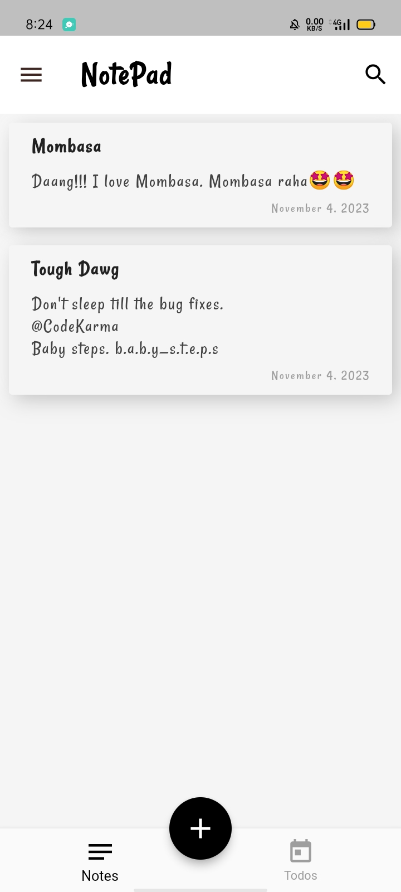
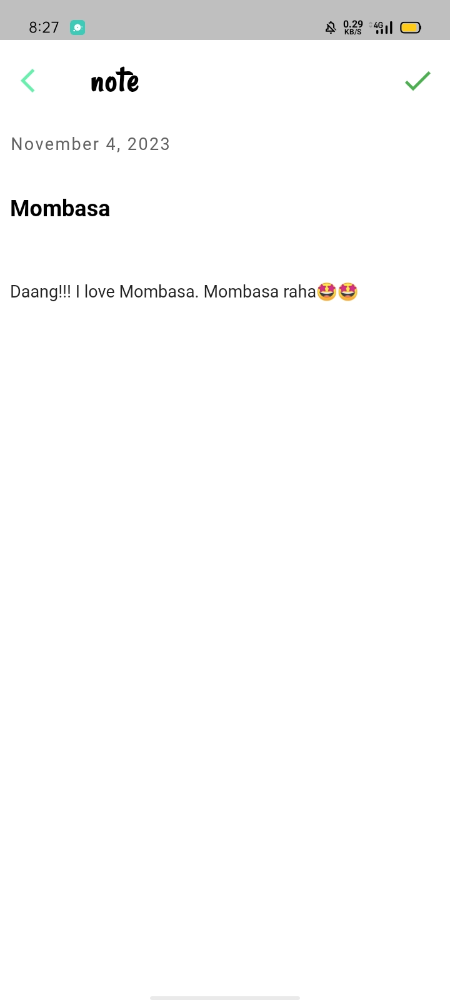
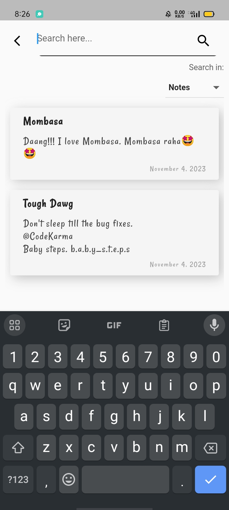
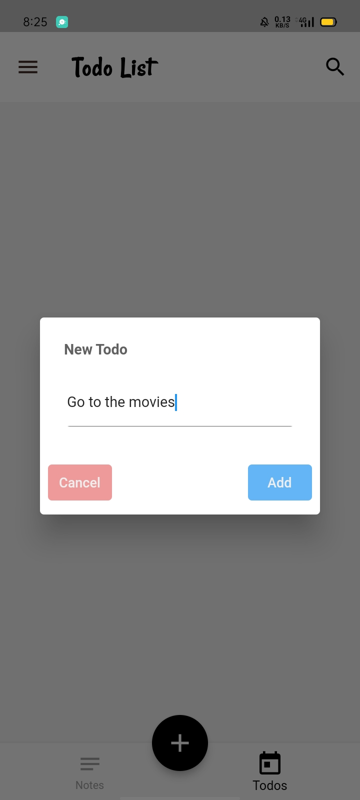
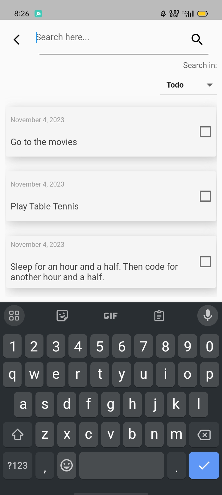
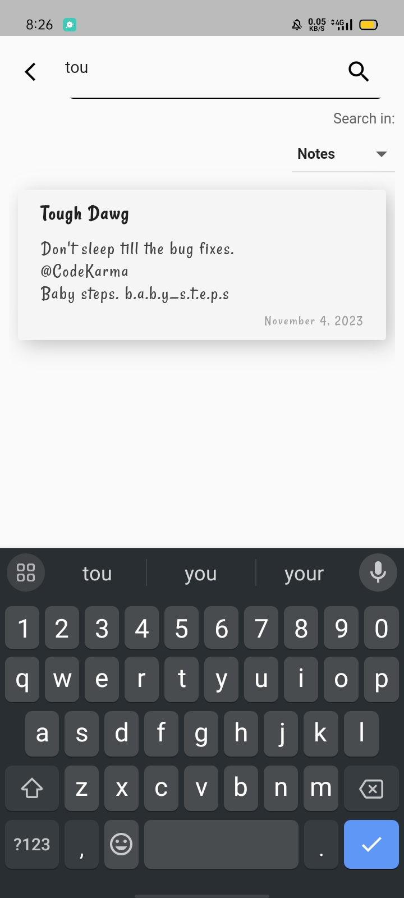

# Notepad App

A Notepad Android application with todo-list additional function. Simple to use UI made all with flutter.

## Notepad
<div id="notepad">
<span>


</span>
...
<span>


</span>
</div>

## Todolist
<div id="notepad">
<span>


</span>
</div>
---
<div id="notepad2">
<span>


</span>
</div>

### Dependencies
```
dependencies:
  flutter:
    sdk: flutter


  # The following adds the Cupertino Icons font to your application.
  # Use with the CupertinoIcons class for iOS style icons.
  cupertino_icons: ^1.0.2
  hive: ^2.2.3
  hive_flutter: ^1.1.0
  google_fonts: ^3.0.1
  fluttertoast: ^8.2.2
  shared_preferences: ^2.2.2
  flutter_native_splash: 
  flutter_launcher_icons: 
  # build_runner: ^2.4.6
  get: ^4.6.6
  flutter_animate: ^4.2.0+1
  date_format: ^2.0.7
  intl: ^0.18.1
```